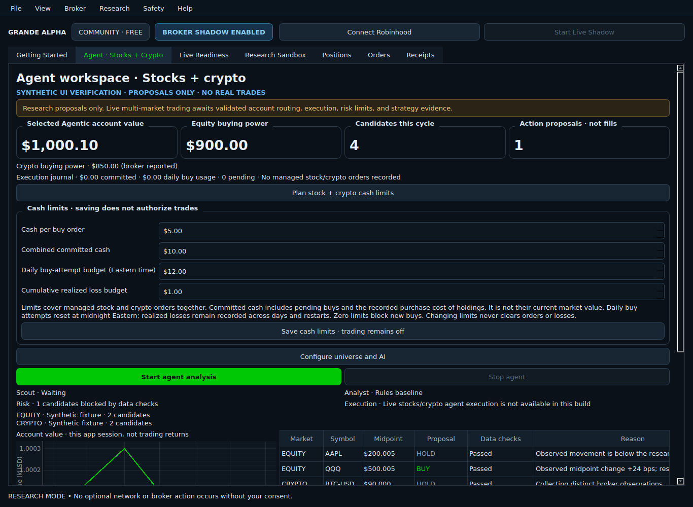

# Managed stock and crypto execution journal

The Agent workspace now includes **Plan stock + crypto cash limits** and a persistent execution
status line. Saving limits does not enable orders or create authority. The app's new executor
uses a default-deny authorizer, and the research agent still has no order-writing callback.

## What can be configured now

Connect the selected Agentic account, open the cash-limit panel, enter the intended amounts,
and choose **Save cash limits · trading remains off**. Limits start at zero and are stored
separately for each account. The controls describe four different budgets:

| Limit | Meaning |
| --- | --- |
| Cash per buy order | Maximum cash reservation for one managed buy |
| Combined committed cash | Pending buy reservations plus the recorded purchase cost of managed holdings across both markets |
| Daily buy-attempt budget | Reserved/attempted buy amounts for the Eastern calendar day; cancellations and rejections do not recycle dispatched usage |
| Cumulative realized loss budget | Sum of negative realized fill increments from managed sales; gains, reauthorization, midnight, and restart do not erase losses |

Committed cash is a cost-based allocation measure, **not current market-value exposure**.
The loss budget covers realized managed losses, not unrealized drawdown, tax-basis accounting,
or all changes in broker account value. Raising or lowering saved limits changes future entry
eligibility without rewriting orders, fills, or usage. Exhausted entry limits do not prohibit a
quantity-bounded reduction of verified managed holdings.

These limits belong to the new multi-market journal. The original ETF session retains its
existing risk settings and confirmation contract. Its authority and buy boundaries block when
the new journal has commitments, managed holdings, or unresolved recovery/provenance problems.

## Durable lifecycle

`AuditStore.agent_ledger` uses the existing local SQLite database. New tables preserve account
scope, strategy identity, exact serialized intent, reference UUID, cash reservation, dispatch
time, broker order identity, immutable execution rows, inventory cost, and recovery events.
Decimal values are stored as text. Transactions use `BEGIN IMMEDIATE`, so separate app
connections cannot both reserve the same remaining capital. The intent digest detects ticket
inconsistency; it is not a cryptographic attestation against an attacker who can rewrite the database.

1. Reserve funds against the shared limits and fresh broker cash. One active order may reserve
   an instrument at a time. A new managed sell requires known managed inventory.
2. Recheck runtime authorization and preview freshness, then **commit the dispatch boundary
   before invoking the broker**. The reference UUID can never be reused.
3. Record the returned broker order identity, or retain the unresolved dispatch if the caller
   times out, is canceled, loses its connection, or exits before recording the response.
4. Recover through account-scoped order and position reads. Only exact references or already
   bound broker order IDs can establish ownership. Recovery never previews, submits, retries,
   or cancels an order, and never resumes authority.
5. Apply cumulative fill deltas atomically when provider execution detail and current inventory
   agree. Partial buys retain the unspent reservation. Terminal cancellation releases only the
   unspent portion; the cost of filled holdings remains committed.

A missing order in a response does not prove it was never submitted. An accepted cancellation
does not prove the order is canceled. Both conditions retain the reservation pending exact
broker evidence. Only a **never-dispatched** local reservation can be released without a broker
outcome; the released reference still cannot be reused. The UI does not yet offer an order
release/cancellation workflow. The backend cancellation boundary described below is available
for future explicitly authorized controls; it is not invoked by restart recovery or the AI.

## Managed cancellation and exits

`AgentExecutor.cancel_managed(ticket)` requires a separate, default-deny cancellation authorizer.
Placement authority alone is insufficient. The executor verifies the unchanged owned ticket,
refreshes its account-scoped order/fill/position state, requires an open order with an exact broker
ID, and rechecks cancellation authority immediately before committing the attempt. An atomic
`agent_cancellations` row prevents two app connections from claiming the same cancellation.
The new table is added without rewriting existing budgets, fills, or tickets.

Each managed order permits one cancellation attempt through this coordinator. An accepted or
rejected acknowledgement, timeout, canceled await, or process restart never permits an automatic
resend. Pending cash and inventory remain governed by the original order. Recovery only reads
the broker; only validated terminal order evidence resolves the cancellation record. A late
acknowledgement cannot overwrite a terminal result established by another app connection.
If cancellation loses a race with a fill, that fill is recorded normally. Partial fills followed
by cancellation retain their purchase cost while releasing only unspent reservations. A rejected
or unresolved attempt requires broker review; there is no retry/reset control in the app yet.

Managed sells still require a fresh quantity-based limit review, their own runtime authorization,
verified managed inventory and sellable quantity, and no open order on the same instrument.
They can reduce verified holdings even when entry budgets are zero or exhausted. Confirmed sales
reduce recorded cost and record fee-net realized gains/losses. These checks do not implement an
automatic exit strategy, stop-loss policy, or broker cancellation of every account order.

If authorization or review freshness fails after reserving cash but before dispatch, the local
reservation is released. Its reference remains consumed. A committed dispatch is never released
on that basis, because its broker outcome may be unknown.

## Reconciliation and cash accounting

Crypto uses provider net executed debit/credit exactly once, including fees and taxes. Equity
cash is computed from validated individual executions and their fees. Repeated snapshots do
not duplicate fills. Missing, duplicated, revised, regressed, or wrongly scoped executions block
recovery. Execution timestamps must fit the recorded dispatch and observation boundaries.

Managed inventory starts from known flat holdings; the executor cannot silently adopt externally
held assets. Unmanaged holdings/open orders block new allocation. An unowned execution on a managed
instrument after management began also blocks recovery, even if a manual round trip leaves the
same quantity. Proportional entry-cost allocation handles partial managed sales, and a final sale
consumes the remaining basis exactly. This is risk bookkeeping, not a tax-lot calculation.

If actual broker debit exceeds its reservation, the ledger records the true debit and blocks
new buys for review. It does not discard the fill or claim the budget guaranteed its price.
There is no automatic override for that block.

## Integration boundary and remaining work

The controller runs recovery on its existing reconciliation cycle when managed journal state
needs it and exposes recovery failures in the Agent page. Reading recovery state grants no
trading permission. Scheduled shadow cannot configure the budget or invoke this recovery route.

The new dispatch coordinator accepts only quantity-based limit routes. The existing equity
intent contract still restricts symbols to TQQQ/SQQQ; this change does not authorize arbitrary
stock orders. Crypto preserves its separate pair identity, account IDs, precision, and GTC rules.
The runtime authorizer defaults to false, including after restart.

Before connecting AI proposals to live execution, the app still needs a reviewed authority
contract bound to strategy/model/universe and evidence; UI/session integration for managed exits
and cancellation;
market-value/unrealized-loss controls; and validated broader equity routing. These are not
satisfied by saving a cash budget or by passing synthetic tests.

Tests use temporary databases and mocked broker callbacks only. They exercise restart recovery,
duplicate prevention, cross-connection allocation races, partial fills/cancellations, fee-net
cash, proportional cost basis, Eastern-midnight usage, unavailable outcomes, account changes,
unmanaged activity, disk-write failure, preview expiry, and default-deny UI integration.
