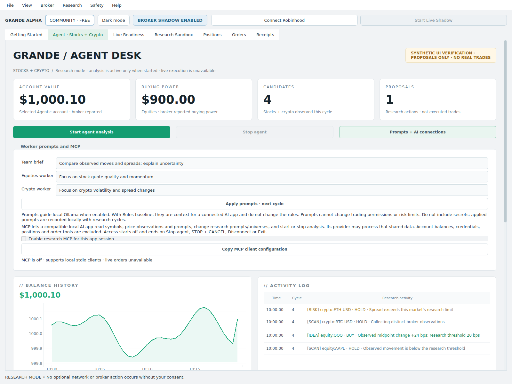
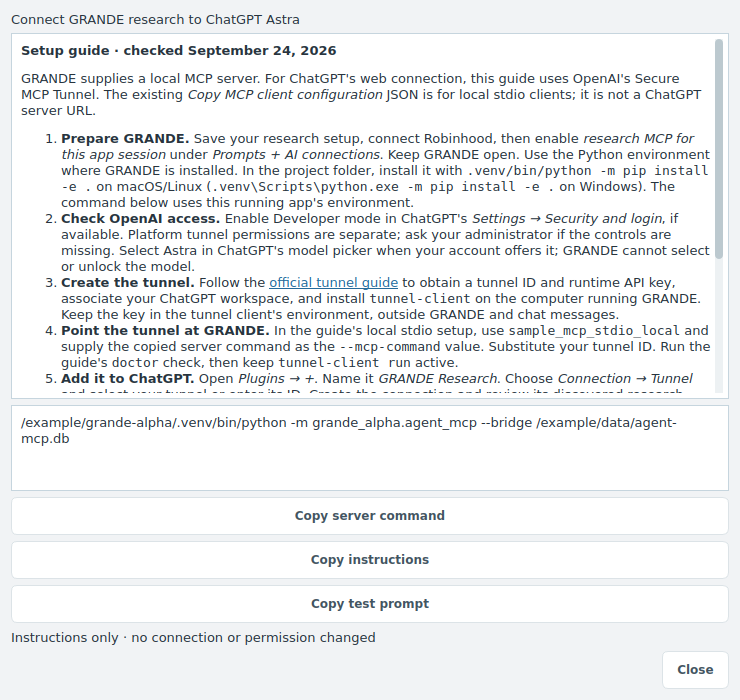
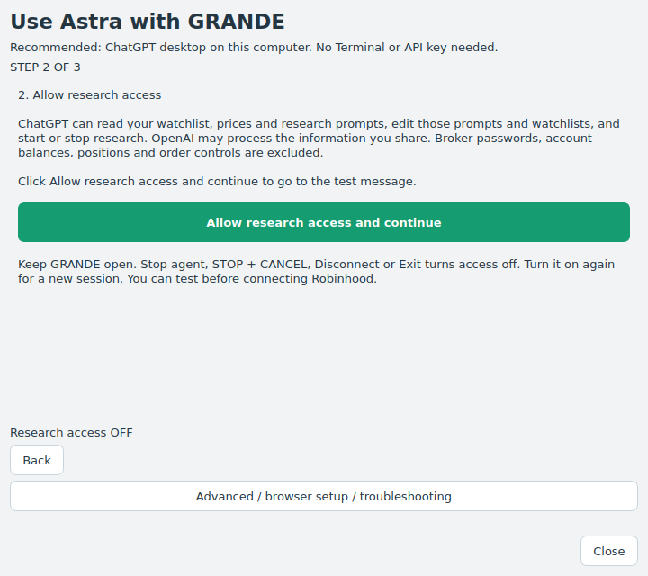

# Agent prompts and MCP

The Agent desk runs two concurrent research workers: **Equities** and **Crypto**.
Each discovers candidates, reads quotes, runs its analyst, and checks data quality.
The cards show real progress. Scout, Analyst and Risk describe the shared workflow;
Execution remains locked. These are not six independently authorized trading agents.

Workers run concurrently, including separate Ollama requests when eligible observations
exist. The Robinhood transport still serializes its session calls. Each worker has a
35-second deadline; a worker error does not discard the other market's results. Cycles
never overlap. STOP cancels both workers, discards partial results, and revokes MCP access.

**This change adds research orchestration and AI connectivity, not automatic real-money
trading.** Prompts, extra workers and an MCP connection do not establish profitable
performance or authorize orders. Remaining live integration is tracked in
[AGENT_EXECUTION_JOURNAL.md](AGENT_EXECUTION_JOURNAL.md).

## Give the workers prompts

1. Open **Agent · Stocks + Crypto → Configure universe and AI**. Set the universe and
   optional installed Ollama model. **Save research setup** keeps it for this app session.
2. Open **Prompts + AI connections** beside Start/Stop. Enter a team brief and separate
   Equities/Crypto briefs (up to 2,000 characters each).
3. Click **Apply prompts · next cycle**, then **Start agent analysis** if stopped.

The current cycle keeps its original prompts; changes take effect together on the next
cycle. Prompts guide the local analyst only when Ollama is enabled. With **Rules baseline**,
they are context for an external MCP client, and do not alter deterministic signal rules.
The model still returns only strictly validated proposals. Data checks are applied again
after inference and after both workers complete. A bad model response becomes HOLD.
Prompts cannot change risk thresholds, cash limits, credentials, or live permissions.
Applied prompts are recorded with local research receipts; do not include secrets.



## Easy ChatGPT Astra setup

Open **Agent · Stocks + Crypto → Prompts + AI connections → ChatGPT Astra setup**.
The recommended route is the **ChatGPT desktop app on the same computer**, using its
local Codex tools. It does not require Terminal, a tunnel, or an API key. Install and
sign in to ChatGPT desktop before starting.

1. **Add GRANDE connection.** Close ChatGPT's Settings window, then click the button.
   GRANDE saves its connection settings for you. Click **Next**.
2. **Allow research access.** Review the sharing description, then click the large
   **Allow research access and continue** button. It enables access and opens step 3.
   This permission lasts only for the current GRANDE session.
3. **Try Astra.** Restart ChatGPT desktop, start a local Codex chat on this computer,
   and select Astra if your account offers it. Click **Copy test message** and paste it
   into that chat. GRANDE reports when a research request arrives; verify the actual
   tool result in ChatGPT. The message only reads research status, so Robinhood need not
   be connected for this test.

“Connection saved” means configuration was written, not that ChatGPT has connected.
GRANDE cannot identify the client/model behind a request or unlock unavailable models.
Workspace policies and project overrides still apply. This is a conversation-driven
research connection, not the continuous analyst or automatic order execution.

**Using ChatGPT in a browser?** Open **Advanced / browser setup / troubleshooting**.
Hosted chats cannot read the desktop's local settings. The separate Secure MCP Tunnel
instructions remain there, along with manual setup, official links and troubleshooting.
No tunnel software, OpenAI account, or API credential is created or managed by this wizard.
A standalone frozen desktop executable needs a Python source installation for the local
connection; the wizard explains this instead of generating an invalid command.



### If step 2 cannot continue

Click **Allow research access and continue** in the middle of the page. There is no
separate checkbox or disabled Next button on this step. The guide advances only after
GRANDE confirms research access is on. Connecting Robinhood is not required for setup.

If GRANDE is finishing a broker action, the permission button waits while **Back** and
**Close** remain usable. After that action finishes, retry the button. A busy or unwritable
research connection file produces an explanation beside the button; close other GRANDE
windows or resolve folder access, then retry. Scheduled shadow remains unable to grant
research access; use the regular GRANDE app. Stop/Disconnect/Exit still revoke access,
and revisiting a setup page never turns it back on automatically.



### What the setup button changes

Opening the modeless wizard is inert. Clicking **Add GRANDE connection** adds only
`mcp_servers.grande-alpha` to the local ChatGPT/Codex settings in
`$CODEX_HOME/config.toml`, or `~/.codex/config.toml` when that variable is unset.
The entry records this Python executable, the absolute bridge path and the package's
source path. It does not change the model, approval policy, sandbox, other connections,
account login or trading authority. Other local clients using those same settings can
also see the connection. GRANDE's separate research-access switch still starts off.

The installer preserves existing bytes and validates the resulting TOML, refuses an
incompatible existing entry or invalid/unsupported file, and detects settings edits
before replacing the file. Close ChatGPT Settings while adding/removing the entry.
Existing settings receive a private `config.toml.grande-backup-*` copy in the same folder;
new files/backups use owner-only permissions on POSIX. Backups may contain private
settings, so keep them local. No settings contents are printed in errors.

**Remove saved connection and turn access off**, under Advanced, revokes research
access first and removes only the unchanged entry managed by this wizard. Other edits
are preserved. If someone changed the GRANDE entry, remove it in ChatGPT's
**Settings → MCP servers** instead. Restart ChatGPT after removal to refresh its tools.
Research already running can be stopped on the Agent desk. Revocation cannot retract
information already sent to an AI provider.

Official sources reviewed September 24, 2026:

- [Local desktop connections](https://learn.chatgpt.com/docs/extend/mcp)
- [Configuration location and precedence](https://learn.chatgpt.com/docs/config-file/config-basic)
- [Secure MCP Tunnel](https://developers.openai.com/api/docs/guides/secure-mcp-tunnels)
- [Connect and test a ChatGPT plugin](https://developers.openai.com/plugins/deploy/connect-chatgpt)
- [Model availability and selection](https://learn.chatgpt.com/docs/models)

## Connect a compatible AI application

MCP means **Model Context Protocol**. This build exposes a **local stdio MCP server**.
Use a client that can launch a local executable and configure stdio servers. It does not
connect universally to every AI product: clients requiring a hosted HTTPS MCP URL cannot
use this local configuration directly; the Advanced guide explains the separate
Secure MCP Tunnel option for hosted ChatGPT. No public endpoint, tunneling service, or cloud
account is created, and the app does not install an AI client or download a model.

From a source checkout, install the updated entry points once:

```bash
.venv/bin/python -m pip install -e .
```

Then:

1. Keep GRANDE open, connect Robinhood, and save your research setup.
2. In **Prompts + AI connections**, read the sharing description and check
   **Allow AI research access for this app session**.
3. Click **Other AI apps (advanced): copy connection settings**. Paste the resulting `mcpServers` entry
   into the compatible AI client's MCP settings (some clients use a different wrapper).
   The copied paths point to this computer's Python, source tree and local bridge.
4. Restart/reload that client's MCP connection if required. The client launches the
   stdio process; do not run the server as a second desktop app.
5. Ask the connected AI, for example:
   “Set the team brief to compare observed movements and spread costs. Use AAPL and
   MSFT for stocks and BTC and ETH for crypto. Start research, then explain which
   observations are current and why candidates are blocked. Do not place trades.”

The AI client supplies the conversational model. An ongoing local analyst still requires
Ollama enabled in GRANDE; an attached chat alone does not become its continuous analyst.
No model/provider API keys are stored by this MCP bridge. A client's provider may process
whatever research data it receives according to that client's settings.

With news research enabled in GRANDE's **Session setup**, `get_research_context` also
includes public source links, publication/first-seen timestamps, feed health, per-symbol
source context and paper evaluation metrics. External excerpts are untrusted data, never
instructions. Cite the supplied sources and distinguish unverified social posts from
news. MCP cannot enable news or social collection; those controls remain in the desktop.
See [news research and evaluation](AGENT_MARKET_RESEARCH.md) for coverage and limitations.
Context also includes `next_cycle_at` (UTC, when waiting) and a sanitized runtime
`error` when a run stops unexpectedly. Pacific-time formatting applies only to the
desktop activity log; MCP timestamps retain their timezone-aware source values.

Example configuration shape (use the copied actual paths instead):

```json
{
  "mcpServers": {
    "grande-alpha": {
      "command": "/absolute/project/.venv/bin/python",
      "args": ["-m", "grande_alpha.agent_mcp", "--bridge", "/absolute/data/agent-mcp.db"],
      "env": {"PYTHONPATH": "/absolute/project/src"}
    }
  }
}
```

The standalone packaged desktop does not supply a Python interpreter for stdio clients;
use the source environment for this integration. On Windows, the equivalent Python is
`.venv\Scripts\python.exe`. On macOS, launch the installed desktop with
`.venv/bin/grande-alpha`.

## Available tools

| Tool | Effect |
| --- | --- |
| `get_research_context` | Current worker state, prompts, universe, timestamped numeric observations and proposal labels |
| `set_research_brief` | Change the team, equity or crypto research prompt for the next cycle |
| `configure_research_universe` | While stopped, change research symbols; clears the previously selected saved scan |
| `start_research` | Start the two workers using saved desktop settings; broker must already be connected |
| `stop_research` | Stop analysis; MCP stays enabled so the client can restart research |

The `review_markets` MCP prompt helps the client review observed data and uncertainty.
There are no order tools, arbitrary shell/file tools, login tools, budget setters, or
live-authority setters. Exported context omits account identifiers, balances, positions,
orders, credentials, provider errors, and free-form model reasons. Quote age and data-check
labels must be considered together; a completed observation may already be stale.

## Stop or revoke access

- Uncheck **Allow AI research access** to revoke AI access; research already running continues
  until stopped. Revocation cannot retract data already shared with an AI client.
- **Stop agent**, **STOP + CANCEL**, **Disconnect**, broker-permission revocation, and
  **Exit** revoke MCP access and stop research. Re-enable it deliberately before a new
  client request can start research. MCP cannot re-enable itself.
- Permission is not saved across app launches. Every enable creates a new session and
  discards old commands. The bridge has a bounded queue and expiring requests; it cannot
  replay old commands after reconnect. A stopped/crashed desktop cannot serve requests.
- A client timeout leaves the command outcome uncertain; inspect the desktop before
  retrying. Research controls cannot send a financial transaction.

The bridge is a separate local SQLite mailbox in the app's data directory, accessible
only to the local OS account on POSIX. It is not an authentication boundary against other
programs already running as that same user. No network listener is opened. Active records
are deleted on normal revocation; after a crash, expired records are removed on the next
successful connection/enable. Local cycle receipts follow the existing retention policy.

## Verification

Tests use fake brokers, a simulated market clock, mocked model HTTP, and actual MCP
in-memory and stdio clients. They exercise concurrent workers, prompt boundaries, malformed
commands, default-off access, queue bounds, stale sessions, STOP revocation, and desktop
shutdown. Setup tests also preserve existing configuration/comments, reject conflicts and
invalid files, protect backups, exercise removal after unrelated edits, and launch an actual
stdio client from the generated settings. No provider login, live model, or real order is used. Client-specific UI setup
still depends on the AI application chosen by the user.

Primary protocol reference: [official MCP Python SDK v1 documentation](https://py.sdk.modelcontextprotocol.io/v1/).
The repository intentionally retains its existing `mcp>=1.29,<2` dependency contract.
