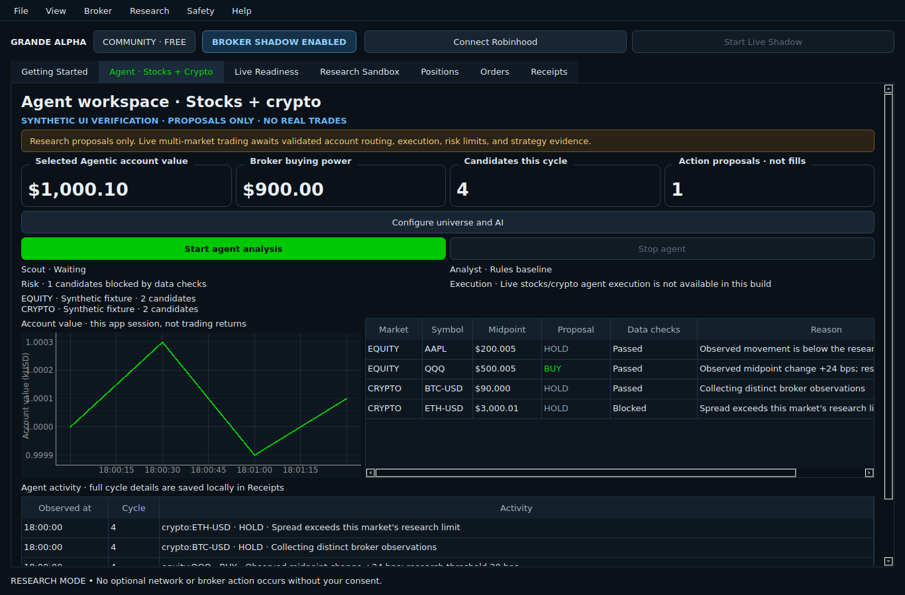

# Stocks and crypto agent workspace

The `tony-dev` Agent workspace implements continuous discovery, observation, analysis,
data-risk screening, and an activity dashboard for equities and Robinhood-supported USD
crypto pairs. **It produces proposals; it does not execute multi-market orders.**
The existing ETF execution engine and its evidence/authority checks remain separate.



## Start an analysis run

1. Enable broker access in Settings and connect your Robinhood Agentic account.
2. Open **Agent · Stocks + Crypto** and **Configure universe and AI**.
3. Enter stock/ETF symbols. The initial watchlist retains QQQ/TQQQ/SQQQ; change it
   to your intended research universe. **Load saved scans** optionally adds candidates
   from an existing Robinhood equity scan. The app does not create or edit scans.
4. Leave crypto blank to discover supported USD pairs, or enter symbols such as
   `BTC, ETH`. The catalog establishes supported pair identity, not account-specific
   permission to trade. Unsupported requested pairs produce a visible error.
5. Choose the cycle interval and optional local model, then **Start agent analysis**.
   Settings apply to this run only. Nothing starts automatically on launch.

Each cycle reads up to 20 candidates per market. Larger universes rotate through
batches. The next cycle starts only after the prior cycle completes plus the configured
interval; slow responses cannot queue overlapping scans. One market's provider error
does not erase the other market's results. Stop, disconnect, broker-permission revocation,
application exit, and STOP + CANCEL stop the research agent. Stopping this analysis
does not cancel broker orders or close positions.

## Analysis and data checks

With AI off, the workspace explicitly reports **Rules baseline**. It needs at least
four distinct provider quote timestamps spanning 60 seconds. It compares midpoint
movement with the larger of 20 basis points and twice the current spread. These are
research heuristics, not a trained model, trading edge, or profitability certificate.

An optional Ollama analyst accepts only the numeric observations for the current
candidates and returns structured buy/hold/exit proposals with reasons. Install and run
Ollama separately and enter the name of an installed local model. Enabling the checkbox
consents to requests to `http://127.0.0.1:11434/api/chat`. No model is downloaded by GRANDE.
The app sends no broker credentials, account IDs, balances, or position information to
the analyst. Ollama's own configuration determines how it processes requests; use a local
model if you want local inference. Stop the agent to revoke model calls immediately.

The analyst has no broker tools. Unknown or duplicate instruments, extra fields, incomplete
responses, tool requests, invalid JSON, and timeouts reject the model output. A model failure
produces HOLD with a visible explanation; it does not quietly switch to rules-based buys.
Model reasons are untrusted commentary, not verified facts. There is no news or sentiment feed.

Independent checks reject invalid, stale, future-dated, repeated, or excessively wide
quotes. Equity proposals are restricted to the regular equity session, including the
existing exchange holiday/early-close calendar. Crypto observations are not stopped by
the equity calendar. Research spread limits are 20 bps for equities and 100 bps for crypto;
the maximum observation age is 15 seconds. Freshness is checked again after model inference.
Crypto `updated_at` is provider quote time, not certified executable-book provenance.
EXIT is a suggestion to evaluate reducing an existing long holding; it is never a short order.

## What the dashboard proves

- Account value and buying power come from the existing selected Agentic portfolio view.
  The chart records that account's observations during this app session. Deposits and
  withdrawals can move it; it is not P&L, a combined crypto-account valuation, or a return chart.
- Candidate and proposal counts come from the last completed agent cycle. Proposals are
  not fills. No synthetic profit, win rate, trade count, or agent conversation is shown.
- Local receipts record each cycle's instrument identities, quotes, analysis mode,
  proposals, reasons, and data-check status. These receipts are not ETF evidence certificates.
- The screenshot above uses labeled synthetic test fixtures and no real account data.

## Live execution work still required

The existing ETF grant only covers the original ticker set and runtime contract. It cannot
authorize arbitrary stocks or crypto. Before adding a live multi-market route, validate:

1. Actual provider schemas and crypto-to-Agentic-account mapping, including separately scoped
   balances, positions, tradability, supported sizes, precision, fees, and order types.
2. Asset-specific preview/place/cancel contracts, immutable execution provenance, partial fills,
   uncertain outcomes, idempotency, restart reconciliation, and managed exits.
3. A shared durable allocation/exposure/loss ledger across both markets and user-selected
   budget limits, with crypto's continuous sessions handled explicitly.
4. Reproducible observations, replay, after-cost evidence, and an authorization contract bound
   to the chosen strategy/model/version, instrument universe, and risk limits.

No flags or receipts are changed to impersonate these checks. Public broker documentation
supports delegated agent orders; per-order confirmation is not a universal Robinhood restriction.
The remaining restriction here is GRANDE's unvalidated implementation and strategy evidence.
The new read adapter checks discovered input argument names and rejects unsupported response
shapes rather than guessing order routes. Its crypto/scanner fixtures are synthetic contract
examples; authenticated compatibility must still be verified against the user's actual server.

After connecting on your computer, open **Configure universe and AI → Export broker compatibility
report**. The JSON contains the server's input/output schemas and tool descriptions, including
crypto order tools, without invoking those tools or including account/quote/credential data.
This report lets a developer implement against the actual advertised contracts. Inspect it
before sharing. If the provider does not advertise output schemas, response compatibility still
requires appropriately redacted read-only fixtures; the export does not manufacture them.

## Development verification

```bash
QT_QPA_PLATFORM=offscreen PYTHONPATH=src python -m pytest -q tests/test_agent_*.py
QT_QPA_PLATFORM=offscreen PYTHONPATH=src:tests python tests/capture_agent_ui.py
```

Tests use fake read callbacks and HTTP transports. They do not authenticate, run a model,
or submit trades. A passing test suite does not certify live provider compatibility.

Primary references (reviewed September 23, 2026):

- [Robinhood: Trading with your agent](https://robinhood.com/us/en/support/articles/trading-with-your-agent/)
- [Ollama: Chat API](https://docs.ollama.com/api/chat)
- [Ollama: Structured outputs](https://docs.ollama.com/capabilities/structured-outputs)
