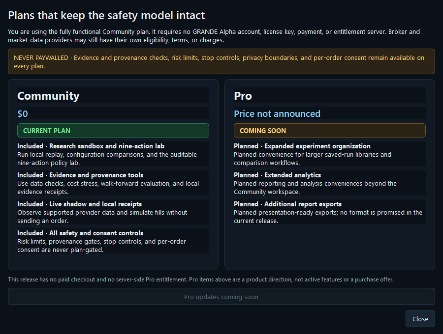

# Community and Pro plans

## Current release

GRANDE Alpha starts on the **Community** plan. Community costs `$0` and is built into the local
application; it does not require a GRANDE Alpha account, license key, payment method, checkout, or
entitlement server. The current release has no paid-plan activation path.



The Community plan includes the implemented product:

- local replay, configuration comparison, and the nine-action policy lab;
- data-readiness, provenance, cost-stress, walk-forward, and evidence tools;
- live shadow and local receipts; and
- every safety boundary, risk limit, stop control, privacy control, and per-order consent step.

Broker and market-data providers can impose their own eligibility rules, terms, subscriptions, or
charges. Those provider conditions are separate from the GRANDE Alpha product plan.

## Pro direction

The desktop can advertise a **Pro — Coming soon** direction. The current Pro card lists only planned
convenience and scale improvements, such as expanded experiment organization, extended analytics,
and additional report exports. These are not implemented entitlements, not a purchase offer, and not
promises about a specific delivery date or price.

GRANDE Alpha will not use a paid tier to weaken or hide:

- evidence and data-provenance checks;
- risk limits and fail-closed execution controls;
- stop, cancellation, privacy, and credential controls; or
- transaction-specific disclosures and consent.

Paid value belongs in convenience, organization, scale, and optional services. A plan can never turn
failed evidence into passing evidence, unlock an otherwise unsafe route, or imply profitability.

## Optional product-information link

Distributors may set the `GRANDE_ALPHA_UPGRADE_URL` environment variable to an HTTPS product-information
page. When configured, **View Pro updates** opens that page only after the user clicks it. The link is
not treated as checkout and does not change local access. Invalid, non-HTTPS, or credential-bearing
URLs are ignored.

If no URL is configured, the button reads **Pro updates coming soon** and remains disabled. GRANDE
Alpha sends no telemetry merely because the plan dialog is opened.

## Entitlement model

The application exposes an explicit local entitlement snapshot:

- active plan: `community`;
- source: built-in local Community access;
- checkout available: `false`; and
- paid entitlement available: `false`.

All implemented plan-controlled feature IDs belong to Community. Planned Pro feature IDs remain
unavailable until a later release implements and documents a real entitlement boundary. Provider
permissions, market-data rights, safety checks, and trading consent are not product entitlements.

The same snapshot is available without a GUI:

```powershell
.\cli.ps1 plans
.\cli.ps1 plans --json
```
