# Responsive desktop UI audit — 2026-08-19

## Audit scope

This combined UX and accessibility audit covers the current PySide6 desktop shell, market overview,
Getting Started, Live Readiness, Research Sandbox, Settings, supervised-session authorization, and
single-order confirmation. The user goal is to keep the same information and controls usable on portrait
and landscape monitors without clipped primary actions.

The final captures use an isolated native Windows Qt process, a fake broker, and a temporary audit database. They do
not connect to Robinhood, change the saved app configuration, or touch the scheduled shadow process.

## Accepted-reference alignment

The user-provided landscape references establish the accepted product language: dark desktop shell,
brand and mode badge, a compact KPI band, chart and quotes beside one another, a tabbed task workspace,
and dense but adjustable evidence tables. The 1366-by-768 and 1920-by-1080 after-captures below preserve
that hierarchy. Responsive behavior is added only when the same composition cannot fit without clipping;
it does not introduce a new visual system or substitute assets.

## Prioritized baseline findings

| Priority | Baseline finding | Direct evidence | Implemented response |
| --- | --- | --- | --- |
| P1 | A hard 1180-pixel minimum prevented real portrait and 1024-pixel layouts. | The requested 900-by-1200 and 1024-by-700 baseline captures rendered at 1180 pixels wide. | Honor the requested window sizes and reflow header, KPI, and market regions at explicit breakpoints. |
| P1 | Long safety review content competed with the exact phrase and safe-default action. | Baseline settings/session/order captures showed vertically dense fixed compositions. | Keep decisions fixed while routing/risk/review detail scrolls independently. |
| P2 | The Sandbox configuration/results composition was optimized for a wide surface only. | The baseline 1366-by-768 Sandbox capture left the results pane narrow and vertically dense. | Switch the main and fill splitters by available aspect/width and reflow result metrics. |
| P2 | Hidden header controls could leave unexplained grid space. | Intermediate constrained captures showed action gaps unrelated to visible choices. | Reflow only visible actions at every breakpoint. |

## Flow and health

### 1. Baseline small-window request — addressed

Before this work, geometry checks measured both the requested 900-by-1200 and 1024-by-700 windows at a
forced 1180-pixel width. The hard minimum has been removed and the exact requested dimensions are now
covered by automated geometry tests and the current screenshots below. Historical screenshots containing
installation-specific copy are intentionally excluded from the public bundle.

### 2. Portrait main workspace at 900 by 1200 — healthy

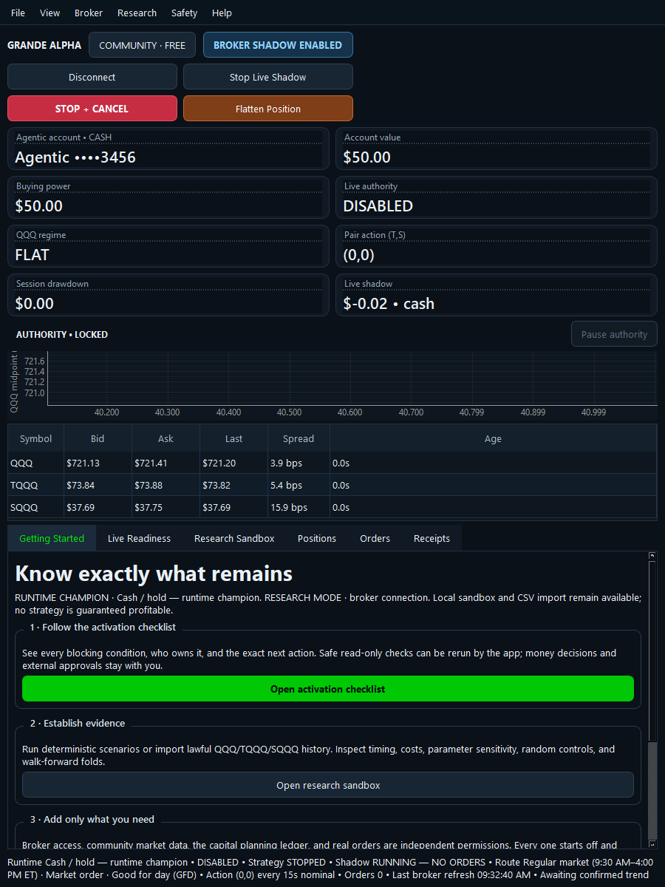

The window now honors 900 pixels. Header actions form a compact two-column grid, KPI cards use two
columns without clipping either text line, and the chart and complete three-symbol quote table stack
vertically. The market and tab workspaces remain separated by an adjustable splitter.

### 3. Landscape main workspace at 1366 by 768 — healthy

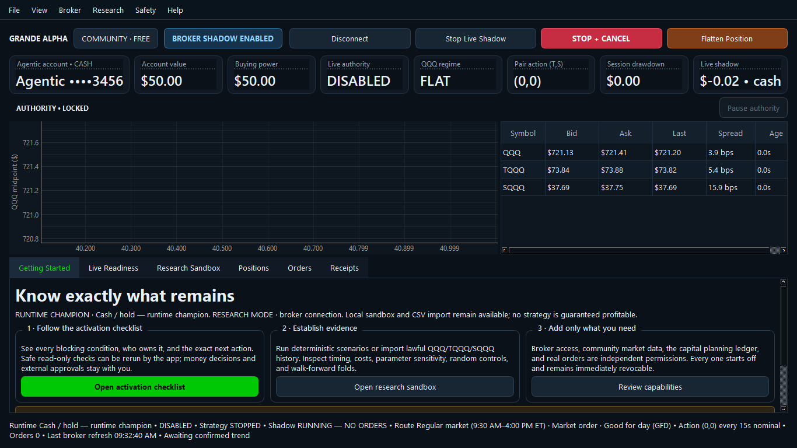

The landscape layout retains the efficient one-row KPI band and horizontal chart/quote split. Visible
actions consume only their real slots, so hidden live controls no longer leave unexplained gaps. The
research/onboarding workspace receives more vertical room than in the intermediate narrow layout.

### 4. Wide desktop at 1920 by 1080 — healthy

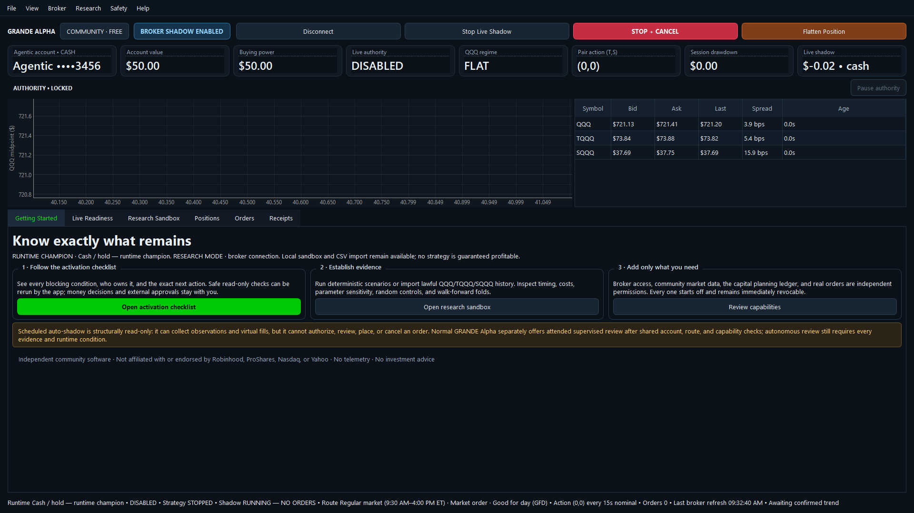

The existing wide-screen hierarchy is preserved: brand and actions share one row, all KPI cards remain in
one band, and chart, quote table, and tab content expand with the window.

### 5. Constrained landscape at 1024 by 700 — healthy with intentional scrolling

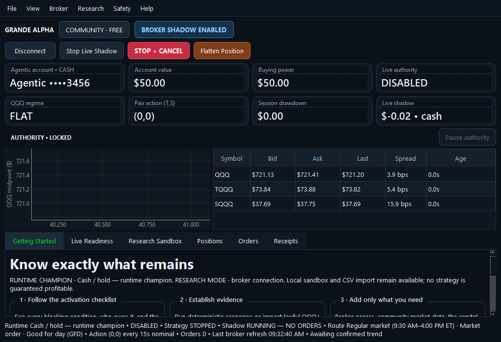

The requested size is now honored. Actions and KPI cards reflow without clipped values. Because this
viewport is landscape, the chart and complete quote table stay side by side instead of competing for two
short vertical panes. Getting Started has its own vertical scroll area, so every card action, safety warning,
and disclosure remains reachable. The tab bar uses its standard scroll affordance, while tables retain
pixel-based horizontal scrolling and manually adjustable columns.

### 6. Research Sandbox in landscape and portrait — healthy

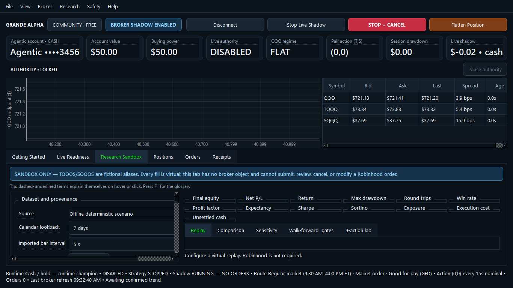

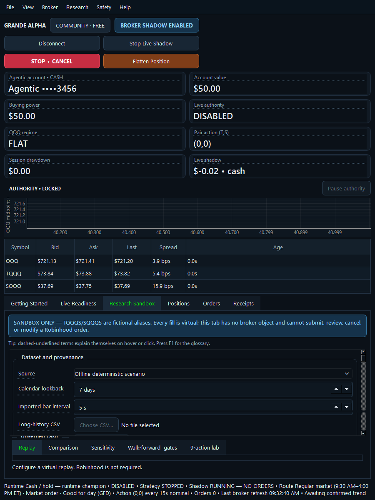

The configuration/results splitter remains horizontal on landscape screens and becomes vertical on a
narrow portrait surface. Metric cards reflow to the available result width. The fill table/inspector also
switches orientation when its result pane is too narrow. Both halves remain independently scrollable and
resizable.

### 7. Live Readiness at 1024 by 700 — healthy

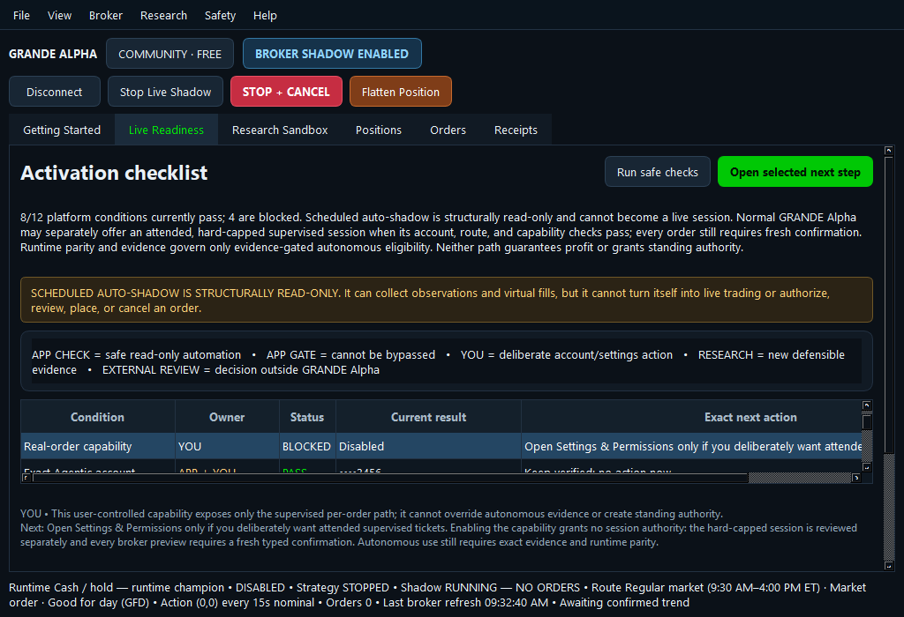

The market overview is intentionally hidden on this task-focused tab. Safe checks, the selected-next-step
action, complete supervised-versus-autonomous summary, ownership legend, and readiness table begin in the
viewport. The task page scrolls vertically so selected-row detail and external links remain reachable
without overpainting the table. The table keeps independent adjustable columns and horizontal scrolling
for full next-action text.

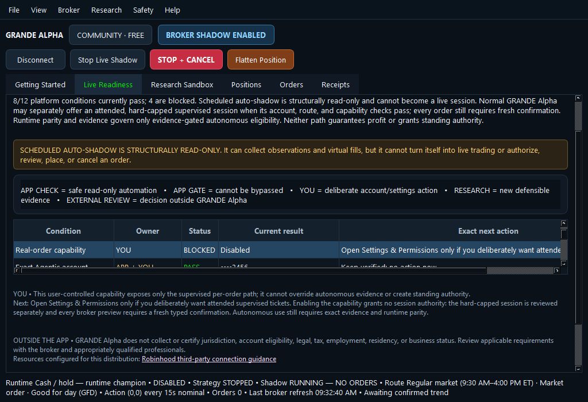

The lower scroll position verifies that the complete selected-row explanation and configured external
guidance link remain readable and clickable at the same constrained size.

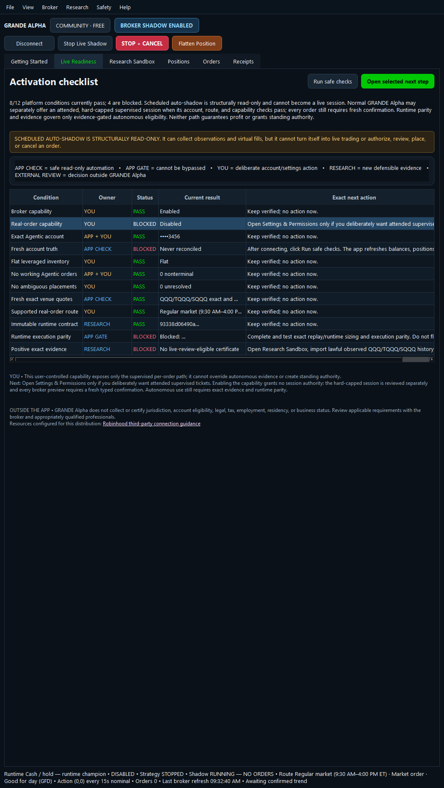

On a tall portrait display, the checklist table now shows every current row without its vertical scrollbar
and is capped at 520 pixels instead of expanding into a large empty table body. The selected-row explanation and the neutral
outside-app jurisdiction/account responsibility remain directly below the checklist. That responsibility
is not a fake pass/fail gate and is excluded from the readiness count.

### 8. Settings and supervised confirmations — healthy

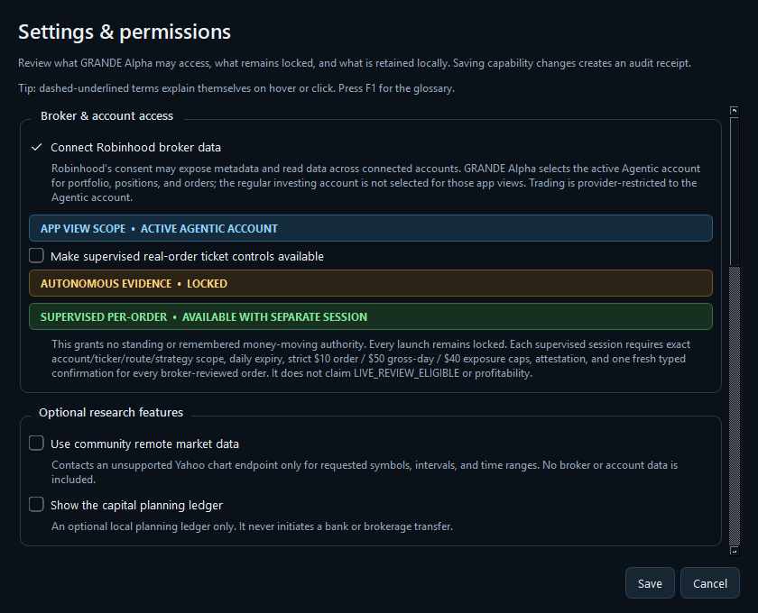

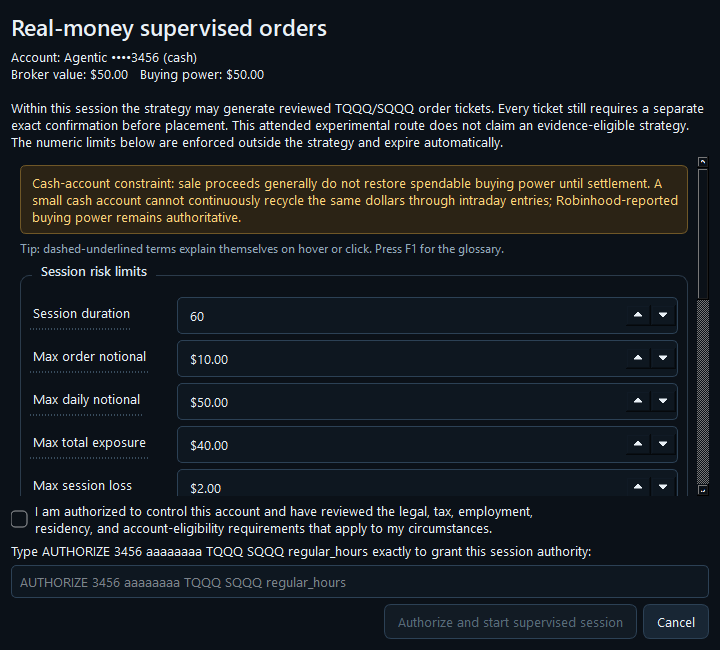

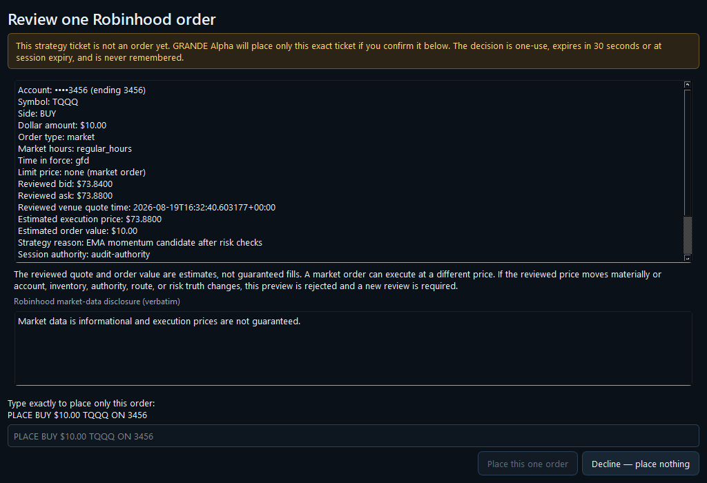

Settings retains fixed Save/Cancel controls around a vertically scrollable body and can now shrink to 640
by 520. The supervised-session dialog scrolls risk/routing detail while keeping attestation, exact typed
phrase, and authorization controls visible. The single-order dialog similarly scrolls the immutable review
and disclosure while keeping the exact order phrase and safe-default Decline action visible at 1024 by 700.

## Strengths retained

- The established dark palette, typography, status colors, card style, tabs, and glossary affordances remain
  unchanged.
- Safety-critical controls preserve their labels and safe defaults; no controller, evidence, broker, or
  order logic changed as part of this UI work.
- Existing table resizing, header help, scrollbars, and the View > Reset Window & Table Columns recovery
  action remain available.

## Accessibility and UX risks addressed

- Primary controls no longer depend on a 1180-pixel minimum width.
- Hidden controls no longer reserve blank grid positions.
- Reading order follows visual order at each breakpoint: brand, actions, account summary, market detail,
  task workspace, and status.
- Safety-critical dialog actions stay visible while long review content scrolls independently.
- Narrow form layouts may wrap long labels above their fields instead of forcing horizontal clipping.

## Evidence limits

- Native Windows capture verifies the local Segoe UI rendering at the captured display scale as well as
  geometry, hierarchy, color, and visible clipping. Other display scales still require separate testing.
- Screenshots cannot prove keyboard traversal, screen-reader announcements, high-contrast mode, display
  scaling above 100 percent, or every translated/long-content state. Those require interactive assistive-
  technology and DPI testing.
- No claim of full WCAG conformance is made.

## Automated checks

`tests/test_responsive_ui.py` verifies all four required viewports: 900 by 1200, 1366 by 768, 1920 by
1080, and 1024 by 700. It checks exact honored size, responsive KPI and market orientation, visible-action
containment and non-overlap, adjustable splitters, portrait/landscape Sandbox behavior, constrained
Settings controls, the 1024 by 700 one-order confirmation, the 620 by 520 supervised-session dialog, metric
value containment, and reachability of every Getting Started action through its vertical scroll area.
The same suite verifies escaped clickable resource links, complete tall-screen checklist visibility, and
intentional checklist scrolling in the constrained 1024-by-700 layout.
