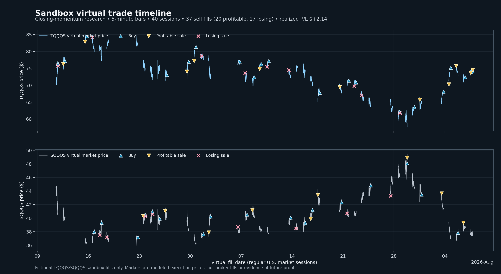

# Strategy research and 0.6.0 benchmark

## Outcome — corrected in 0.8.0

The previously published `+4.27%` closing-window result was invalid. A bar-count hold calculation
treated overnight gaps as if no time elapsed, allowing unintended overnight exposure. Version
0.7 corrected elapsed time and version 0.8 reran the frozen hash. Closing momentum is now `-2.94%`;
every candidate is negative after modeled costs. All strategies remain **SHADOW_ONLY** and no
candidate has a live certificate. The old positive number and its static trade image must not be
used as performance evidence.

## Frozen dataset and assumptions

| Field | Value |
|---|---|
| Source | Yahoo Finance chart endpoint, unsupported research source |
| Downloaded | 2026-08-10 00:39:08 UTC |
| Interval | 5 minutes |
| Aligned instruments | QQQ, TQQQ, SQQQ |
| Sessions / frames | 40 / 3,121 |
| Integrity | Clean alignment; zero detected missing intervals |
| SHA-256 dataset hash | `a273085fced5ef3105f8c08843a907baf5ceff0f32f32555cfae2f4722cdff8c` |
| Starting virtual cash / order cap | $50 / $25 |
| Baseline spread / slippage | 2 bps / 2 bps |
| Stress case | 3x spread, slippage, and commissions |
| Walk-forward | Fixed candidate; 20 train sessions, 5 test sessions, 5-session step |
| Random control | 100 seeded random direction/entry trials |

Yahoo's endpoint is convenient but unlicensed and not execution-grade. The Alpaca connector was
cross-checked separately with an explicit August 7 regular session and returned 79 five-minute
bars for each instrument (237 total); it was not mixed into or substituted for this frozen
benchmark. Binance was inspected only for order-book interface ideas. Crypto prices were not used
to create or tune an ETF signal.

## Complete tournament

All rows use the same dataset and execution model. “Random %ile” is only a basic seeded control.
The same-data ranking is exploratory, and selecting the best row makes that row in-sample.

| Candidate | Return | Net P/L | Max DD | PF | Trades | 3x-cost return | Random %ile | WF positive | WF avg return | WF trades |
|---|---:|---:|---:|---:|---:|---:|---:|---:|---:|---:|
| EMA balanced | -4.78% | -$2.39 | 5.00% | 0.52 | 126 | -5.93% | 66 | 0% | -0.64% | 82 |
| EMA fast | -4.34% | -$2.17 | 4.54% | 0.30 | 87 | -5.80% | 89 | 0% | -0.61% | 62 |
| EMA slow | -2.14% | -$1.07 | 3.80% | 0.70 | 78 | -3.69% | 59 | 25% | -0.34% | 49 |
| Closing momentum | -2.94% | -$1.47 | 4.59% | 0.54 | 40 | -4.96% | 47 | 0% | -0.53% | 15 |
| Multi-horizon trend | -4.83% | -$2.41 | 5.05% | 0.40 | 104 | -6.97% | 64 | 0% | -0.47% | 63 |
| Opening breakout | -0.66% | -$0.33 | 2.43% | 0.93 | 101 | -3.25% | 81 | 50% | +0.12% | 55 |
| Agreement ensemble | -5.27% | -$2.63 | 5.56% | 0.40 | 103 | -6.79% | 62 | 25% | -0.45% | 62 |

Every row ended flat. The purged fold set is below the policy minimum of five; the built-in
5-minute source also falls below the new 120-session breadth gate. A lawful long-history import and
a genuinely untouched final holdout are required before another promotion attempt.

## Legacy virtual sales timeline — invalidated

The image below is retained only as an audit artifact showing the former behavior. It includes the
invalidated overnight result and is not a current performance plot.

The chart makes possible early exits visible, but it does not prove that holding longer would have
improved a causal strategy. That question requires predeclared post-sale opportunity windows,
maximum-favorable/adverse-excursion metrics, and untouched out-of-sample validation.

## Evidence basis and code-adoption decisions

The strongest immediately testable market hypothesis was closing-window continuation documented
by Gao, Han, Li, and Zhou, “Market intraday momentum,” *Journal of Financial Economics* (2018),
[DOI 10.1016/j.jfineco.2018.05.009](https://doi.org/10.1016/j.jfineco.2018.05.009). Baltussen,
Da, Lammers, and Martens study a related hedging-demand mechanism in *Journal of Financial
Economics* (2021), [DOI 10.1016/j.jfineco.2021.04.029](https://doi.org/10.1016/j.jfineco.2021.04.029).
These papers motivate a hypothesis; they do not validate this implementation, this recent sample,
leveraged-ETF execution, or future profit.

Repository research was used as an architecture and testing review:

| Project | License checked | Decision |
|---|---|---|
| [timeseriescv](https://github.com/sam31415/timeseriescv) | MIT | Concept reference for future purge/embargo work; current folds are session-separated; do not add the stale dependency |
| [bt](https://github.com/pmorissette/bt) | MIT | Use standard inverse-volatility/target-vol concepts only |
| [Qlib](https://github.com/microsoft/qlib) | MIT | Keep rolling out-of-sample artifact discipline; do not embed the heavy stack |
| [LEAN](https://github.com/QuantConnect/Lean) | Apache-2.0 | Reference mature risk/fill separation; do not embed the C# engine |
| [NautilusTrader](https://github.com/nautechsystems/nautilus_trader) | LGPL-3.0 | Architecture reference only |
| [vectorbt](https://github.com/polakowo/vectorbt) | Apache-2.0 plus Commons Clause | Do not copy or embed in a commercial public product |
| [backtesting.py](https://github.com/kernc/backtesting.py) | AGPL-3.0 | Do not embed without a separate license decision |

Reinforcement learning, brute-force GPU optimization, simultaneous TQQQ/SQQQ holdings, and
volume/VWAP-dependent strategies were excluded. They add complexity, licensing, or data-parity
risk without demonstrating a causal, after-cost edge here.

## Next evidence step

Freeze a licensed dataset with at least 120 sessions, reserve a final untouched period before any
new tuning, run candidate-specific sensitivity and cost stress, and keep a total-trial ledger.
Only a candidate that passes every current gate may reach a separate bounded live review. A failed
candidate remains useful research, but it is not a reason to trade real money.
